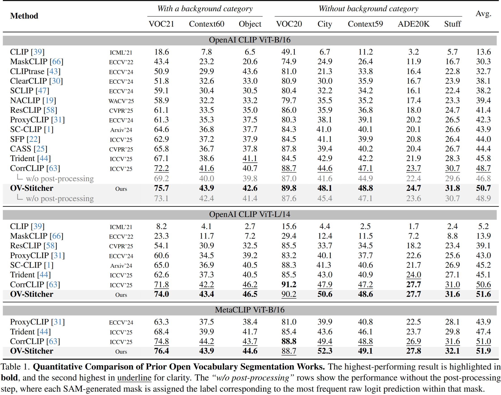

<div align="center">

# 🪡 OV-Stitcher: A Global Context-Aware Framework for Training-Free Open-Vocabulary Semantic Segmentation 
<div>
    <a href='#' target='_blank'>Seungjae Moon</a><sup></sup>&emsp;
    <a href='#' target='_blank'>Seunghyun Oh</a><sup></sup>&emsp;
    <a href='#' target='_blank'>Youngmin Ro</a><sup>*</sup>&emsp;
</div>

<div>
    <strong>[CVPR 2026 Findings]</strong>
</div>

[](https://arxiv.org/abs/2604.08110)

</div>

## 📄Overview
<div align="center">
   
</div>

> **Abstract**: Training-free open-vocabulary semantic segmentation (TFOVSS) has recently attracted attention for its ability to perform dense prediction by leveraging the pretrained knowledge of large vision and vision–language models, without requiring additional training. However, due to the limited input resolution of these pretrained encoders, existing TFOVSS methods commonly adopt a sliding-window strategy that processes cropped sub-images independently. While effective for managing high-resolution inputs, this approach prevents global attention over the full image, leading to fragmented feature representations and limited contextual reasoning. We propose OV-Stitcher, a training-free framework that addresses this limitation by stitching fragmented sub-image features directly within the final encoder block. By reconstructing attention representations from fragmented sub-image features, OV-Stitcher enables global attention within the final encoder block, producing coherent context aggregation and spatially consistent, semantically aligned segmentation maps. Extensive evaluations across eight benchmarks demonstrate that OV-Stitcher establishes a scalable and effective solution for open-vocabulary segmentation, achieving a notable improvement in mean Intersection over Union (mIoU) from 48.7 to 50.7 compared with prior training-free baselines.

## ⚙️Datasets
`With background class`: PASCAL VOC (VOC21), PASCAL Context (PC60), and COCO Object (Object),

`Without background class`: VOC20, PC59 (i.e., VOC21 and PC60 without the background category), Cityscapes (City), ADE20k (ADE), and COCO Stuff164k (Stuff).

Please follow the data preparation document of [MMSeg](https://github.com/open-mmlab/mmsegmentation/blob/main/docs/en/user_guides/2_dataset_prepare.md) to download and pre-process
the datasets. Move the datasets to the `data/` directory.
The COCO Object dataset can be converted from COCO Stuff164k by executing the following command:

```
python datasets/cvt_coco_object.py PATH_TO_COCO_STUFF164K -o PATH_TO_COCO164K
```

## 📊Results
<div align="center">
   
</div>

<div>
   
</div>

## Code
Code will be released soon.

## 📌 Citation
```bibtex
@article{moon2026ovstitcher,
  title={OV-Stitcher: A Global Context-Aware Framework for Training-Free Open-Vocabulary Semantic Segmentation},
  author={Moon, Seungjae and Oh, Seunghyun and Ro, Youngmin},
  journal={arXiv preprint arXiv:2604.08110},
  year={2026}
}
```

## 🙇‍♂️ Acknowledgement

This project builds upon several excellent open-source efforts [SCLIP](https://github.com/wangf3014/SCLIP), [ProxyCLIP](https://github.com/mc-lan/ProxyCLIP), [CorrCLIP](https://github.com/zdk258/CorrCLIP), [SAM 2](https://github.com/facebookresearch/sam2).
We sincerely thank the authors for making their work publicly available.


