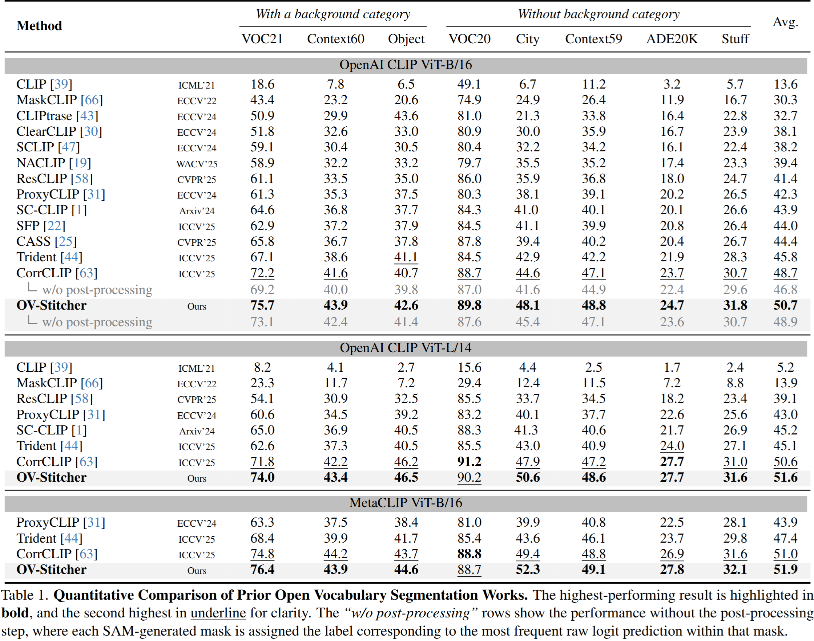

<div align="center">

# 🪡OV-Stitcher: A Global Context-Aware Framework for Training-Free Open-Vocabulary Semantic Segmentation 
<div>
    <a href='https://scholar.google.com/citations?hl=ko&user=lwjMuSMAAAAJ' target='_blank'>Seungjae Moon</a><sup></sup>&emsp;
    <a href='#' target='_blank'>Seunghyun Oh</a><sup></sup>&emsp;
    <a href='https://scholar.google.com/citations?hl=ko&user=-2MnHEIAAAAJ' target='_blank'>Youngmin Ro</a><sup>*</sup>&emsp;
</div>

<div>
    <strong>[CVPR 2026 Findings]</strong>
</div>

[](https://arxiv.org/abs/2604.08110)
[](https://openaccess.thecvf.com/content/CVPR2026F/papers/Moon_OV-Stitcher_A_Global_Context-Aware_Framework_for_Training-Free_Open_Vocabulary_Semantic_CVPRF_2026_paper.pdf)

</div>

## 📄Overview
<div align="center">
   
</div>

> **Abstract**: Training-free open-vocabulary semantic segmentation (TFOVSS) has recently attracted attention for its ability to perform dense prediction by leveraging the pretrained knowledge of large vision and vision–language models, without requiring additional training. However, due to the limited input resolution of these pretrained encoders, existing TFOVSS methods commonly adopt a sliding-window strategy that processes cropped sub-images independently. While effective for managing high-resolution inputs, this approach prevents global attention over the full image, leading to fragmented feature representations and limited contextual reasoning. We propose OV-Stitcher, a training-free framework that addresses this limitation by stitching fragmented sub-image features directly within the final encoder block. By reconstructing attention representations from fragmented sub-image features, OV-Stitcher enables global attention within the final encoder block, producing coherent context aggregation and spatially consistent, semantically aligned segmentation maps. Extensive evaluations across eight benchmarks demonstrate that OV-Stitcher establishes a scalable and effective solution for open-vocabulary segmentation, achieving a notable improvement in mean Intersection over Union (mIoU) from 48.7 to 50.7 compared with prior training-free baselines.


## Installation

Tested on Linux with Python 3.10, PyTorch 2.1.0, CUDA 12.1, and MMCV 2.1.0. From the repository root:

```bash
conda create -n ov-stitcher python=3.10 -y
conda activate ov-stitcher
python -m pip install torch==2.1.0 torchvision==0.16.0 --index-url https://download.pytorch.org/whl/cu121
python -m pip install -r requirements.txt
python -m pip install --only-binary=mmcv mmcv==2.1.0 -f https://download.openmmlab.com/mmcv/dist/cu121/torch2.1/index.html
```

The repository contains its own `mmengine`, `mmseg`, and modified `open_clip` packages. PyTorch and MMCV are installed separately to match the CUDA build ([PyTorch wheels](https://pytorch.org/get-started/previous-versions/), [MMCV installation](https://mmcv.readthedocs.io/en/2.x/get_started/installation.html)). The default CLIP and DINO weights are downloaded on first use.

## ⚙️Datasets

Place the validation datasets under `data/` (or symlink `data` to a prepared dataset directory). Paths below are relative to the repository root:

| Configs | Images | Ground truth | Split file |
| --- | --- | --- | --- |
| `cfg_voc20.py`, `cfg_voc21.py` | `data/VOCdevkit/VOC2012/JPEGImages/*.jpg` | `data/VOCdevkit/VOC2012/SegmentationClass/*.png` | `data/VOCdevkit/VOC2012/ImageSets/Segmentation/val.txt` |
| `cfg_context59.py`, `cfg_context60.py` | `data/VOCdevkit/VOC2010/JPEGImages/*.jpg` | `data/VOCdevkit/VOC2010/SegmentationClassContext/*.png` | `data/VOCdevkit/VOC2010/ImageSets/SegmentationContext/val.txt` |
| `cfg_ade20k.py` | `data/ADEChallengeData2016/images/validation/*.jpg` | `data/ADEChallengeData2016/annotations/validation/*.png` | — |
| `cfg_city_scapes.py` | `data/cityscapes/leftImg8bit/val/<city>/*_leftImg8bit.png` | `data/cityscapes/gtFine/val/<city>/*_gtFine_labelTrainIds.png` | — |
| `cfg_coco_object.py` | `data/coco_object/images/val2017/*.jpg` | `data/coco_object/annotations/val2017/*_instanceTrainIds.png` | — |
| `cfg_coco_stuff164k.py` | `data/coco_stuff164k/images/val2017/*.jpg` | `data/coco_stuff164k/annotations/val2017/*_labelTrainIds.png` | — |

Please follow the data preparation document of [MMSeg](https://github.com/open-mmlab/mmsegmentation/blob/main/docs/en/user_guides/2_dataset_prepare.md) to download and pre-process
the datasets. Move the datasets to the `data/` directory.
The COCO Object dataset can be converted from COCO Stuff164k by executing the following command:

```
python datasets/cvt_coco_object.py PATH_TO_COCO_STUFF164K -o PATH_TO_COCO164K
```

With the default `mask_generator=None`, every validation image also needs a precomputed instance mask at `data/region_masks/{voc,context,ade,city,coco}/<image_stem>.npz`. The `.npz` must contain an `instance_mask` array with one integer ID per pixel. VOC20/21 share `voc`, Context59/60 share `context`, and both COCO configs share `coco`. [Precomputed region masks](https://huggingface.co/datasets/dk258/CorrCLIP/tree/main) are available separately. Datasets and masks are not included in this repository. If your paths differ, edit the corresponding file in `configs/`.


`With background class`: PASCAL VOC (VOC21), PASCAL Context (PC60), and COCO Object (Object),

`Without background class`: VOC20, PC59 (i.e., VOC21 and PC60 without the background category), Cityscapes (City), ADE20k (ADE), and COCO Stuff164k (Stuff).


## Evaluation

Run these commands from the repository root after preparing the data:

```bash
# One GPU (example: GPU 0, VOC21)
CUDA_VISIBLE_DEVICES=0 python eval.py --config configs/cfg_voc21.py

# Two GPUs, one dataset
CUDA_VISIBLE_DEVICES=0,1 bash dist_test.sh configs/cfg_voc21.py 2

# All eight configs, sequentially on one GPU
CUDA_VISIBLE_DEVICES=0 python eval_all.py
```

Replace `cfg_voc21.py` with any config listed above. Results are saved in `work_dirs/`, `results.xlsx`, and `111.txt`. Model choices and the prompt file are set in `configs/base_config.py`; the default prompt is `prompts/class_biased_template.json`. Alternative mask generators require their own dependencies and weights.


## 📊Results
<div align="center">
   
</div>

<div>
   
</div>

## 📌 Citation
```bibtex
@article{moon2026ovstitcher,
  title={OV-Stitcher: A Global Context-Aware Framework for Training-Free Open-Vocabulary Semantic Segmentation},
  author={Moon, Seungjae and Oh, Seunghyun and Ro, Youngmin},
  journal={arXiv preprint arXiv:2604.08110},
  year={2026}
}

@InProceedings{Moon_2026_CVPR,
    author    = {Moon, Seungjae and Oh, Seunghyun and Ro, Youngmin},
    title     = {OV-Stitcher: A Global Context-Aware Framework for Training-Free Open Vocabulary Semantic Segmentation},
    booktitle = {Proceedings of the IEEE/CVF Conference on Computer Vision and Pattern Recognition (CVPR) Findings},
    month     = {June},
    year      = {2026},
    pages     = {7357-7367}
}
```

## 🙇‍♂️ Acknowledgement

This project builds upon several excellent open-source efforts [SCLIP](https://github.com/wangf3014/SCLIP), [ProxyCLIP](https://github.com/mc-lan/ProxyCLIP), [CorrCLIP](https://github.com/zdk258/CorrCLIP), [SAM 2](https://github.com/facebookresearch/sam2).
We sincerely thank the authors for making their work publicly available.


